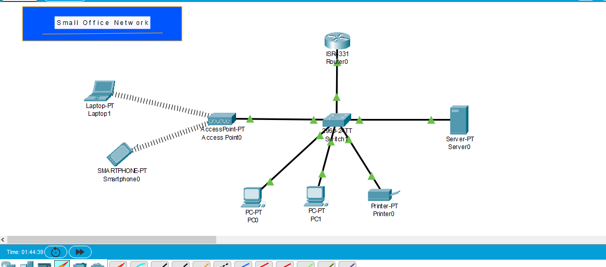

# Small Office Network

## 📌 Overview

This project demonstrates the design and configuration of a small office network using Cisco Packet Tracer.

## 🖥️ Network Devices

- 1 Router
- 1 Switch
- 2 PCs
- 1 Server
- 1 Network Printer
- 1 Access Point
- 1 Laptop
- 1 Smartphone

## 🌐 Network Topology

## 🔧 Technologies Used

- Cisco Packet Tracer
- IPv4 Addressing
- DHCP
- Ethernet
- Wireless Networking
- Basic Router Configuration
- Basic Switch Configuration
- Network Connectivity Testing

## 📡 Wireless Network

The Access Point provides wireless connectivity to:

- Laptop
- Smartphone

SSID:

Office-WiFi

## 🔢 IP Addressing

| Device | IP Configuration |
|---|---|
| Router | 192.168.1.1 |
| PC1 | DHCP |
| PC2 | DHCP |
| Server | DHCP |
| Printer | DHCP |
| Laptop | DHCP |
| Smartphone | DHCP |

Subnet Mask:

255.255.255.0

Default Gateway:

192.168.1.1

## ⚙️ DHCP

The router was configured as a DHCP server to automatically assign IP addresses to network devices.

DHCP provides:

- IP Address
- Subnet Mask
- Default Gateway
- DNS Server

## 🧪 Connectivity Testing

Network connectivity was tested using the ping command.

Tests included:

- PC1 → Router
- PC1 → PC2
- PC1 → Server
- Laptop → Router
- Laptop → PC1

All required connectivity tests were successfully completed.

## 🎯 Learning Objectives

Through this lab, I practiced:

- Connecting Router and Switch
- Basic Cisco IOS configuration
- IPv4 addressing
- DHCP configuration
- Switch connectivity
- Wireless Access Point configuration
- Connecting wireless clients
- Network troubleshooting
- Connectivity testing using ping

## 📁 Project Files

- Small-Office-Network.pkt — Cisco Packet Tracer project
- topology.png — Network topology screenshot
- README.md — Lab documentation

## 👨‍💻 Author

Muhammad Jamal

CCNA Networking Labs
