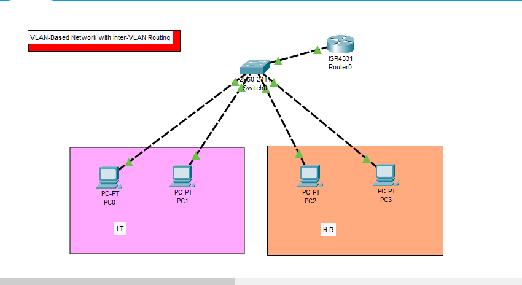
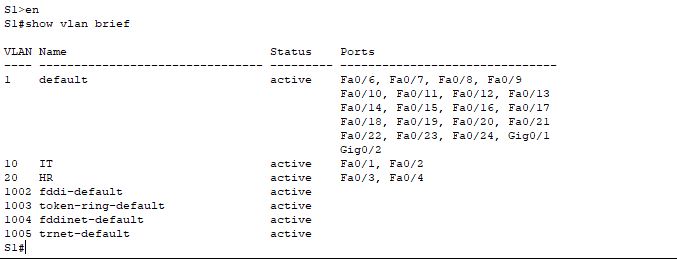
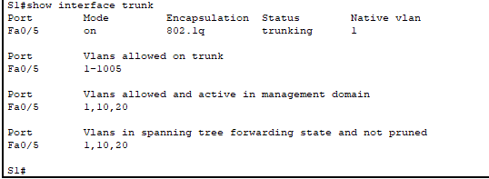
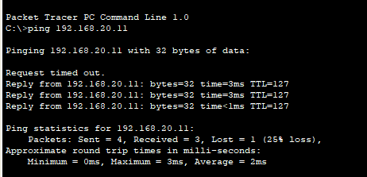
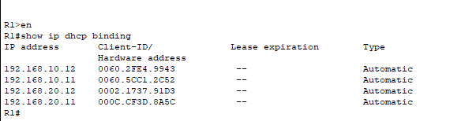
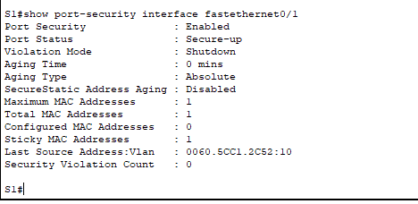

# Project 2 - VLAN-Based Network with Inter-VLAN Routing

## Project Overview

This project demonstrates a VLAN-based network created using Cisco Packet Tracer.

The network contains two departments:

- IT Department - VLAN 10
- HR Department - VLAN 20

Inter-VLAN Routing, DHCP, and Switch Port Security were configured and verified.

## Devices Used

- 1 Cisco Router (R1)
- 1 Cisco Switch (SW1)
- 4 PCs

## VLAN Configuration

| VLAN | Department | Network |
|---|---|---|
| 10 | IT | 192.168.10.0/24 |
| 20 | HR | 192.168.20.0/24 |

## Main Features

- VLAN Configuration
- Access Ports
- Trunk Port
- Router-on-a-Stick
- Inter-VLAN Routing
- DHCP
- Switch Port Security
- Sticky MAC Address

## Verification

The following commands were used for verification:

show vlan brief

show interfaces trunk

show ip interface brief

show ip dhcp binding

show port-security interface fastEthernet 0/1

## Project Screenshots

### Network Topology

### VLAN Verification

### Trunk Verification

### Inter-VLAN Ping

### DHCP Verification

### Port Security

## Skills Learned

- Cisco IOS
- VLANs
- Inter-VLAN Routing
- Router-on-a-Stick
- DHCP
- Trunking
- Port Security
- Network Troubleshooting
- Cisco Packet Tracer

## Project Status

Completed
